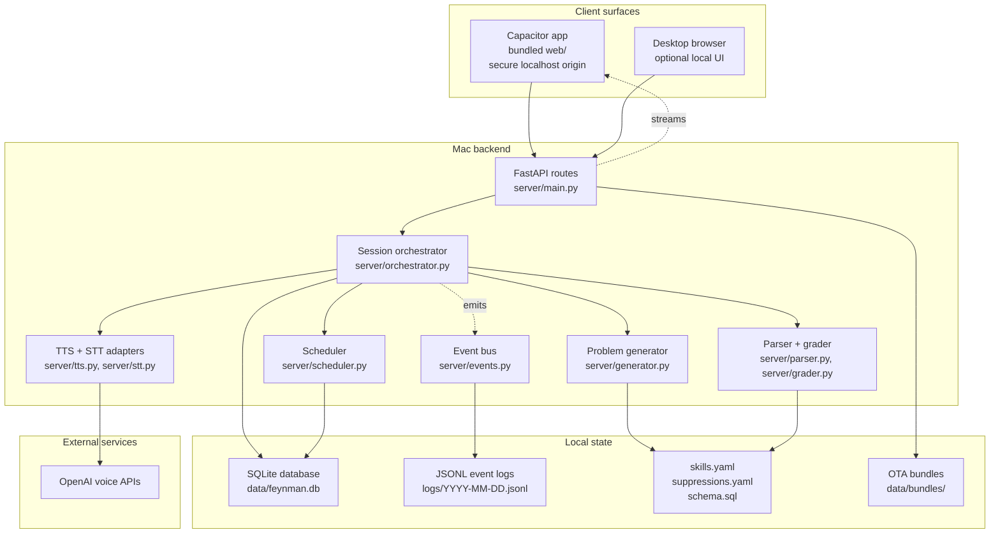
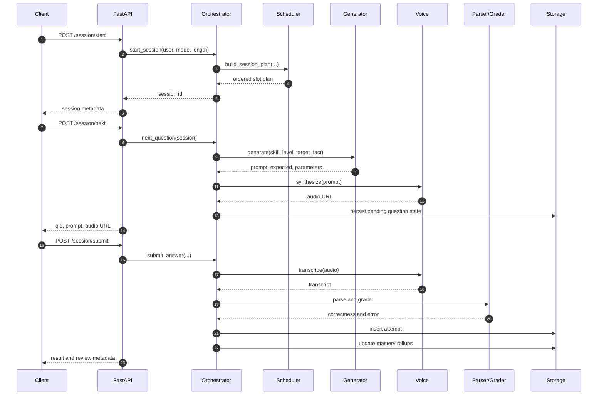

# Feynman Architecture

Feynman is a personal voice-first cognitive trainer. The current app is a
Capacitor mobile shell that bundles `web/` locally and talks to a private FastAPI
backend on the Mac. The backend owns scheduling, problem generation, grading,
storage, TTS/STT, offline seed packs, and app update manifests.

This page is the high-level map. Generated reference pages cover the detailed
decision logic:

- [Decision flows](../reference/decision-flows.html)
- [Config reference](../reference/config.html)
- [Database schema](../reference/schema.html)
- [API reference](../server.html)

## Topology

The mobile app's UI is served from its bundled assets, so microphone capture runs
in a secure localhost context. API calls go cross-origin to the private backend.
The backend is launchd-managed and does not hot-reload, so server code changes
require a backend restart before the device sees new behavior.

## Session Lifecycle

The client can also call `/session/peek` to pre-generate the next question and
`/session/attempts/bulk` or `/sync/bulk` to flush offline records. The backend is
authoritative for grading and mastery updates even when the mobile app captures
attempts offline.

## Scheduler And Generation

The scheduler builds a full session plan instead of choosing every problem from
scratch. It reads recent attempts, computes diagnosis priorities, reserves a
grounded block, adds retention checks, chooses foundation themes, and spreads
duplicates. The generated [decision flow reference](../reference/decision-flows.html)
shows the current order and links to the exact code.

Problem generation is a separate step. The generator receives the scheduled
`skill_id`, `level`, and optional `target_fact`, renders a candidate problem, and
checks active suppression rules. Suppressions are configured in
`suppressions.yaml` and implemented in `server/suppressions.py`; the public docs
link both without publishing private local data.

## Storage

SQLite is the source of truth for users, sessions, attempts, skill definitions,
mastery rollups, and feedback. `schema.sql` is checked in and the generated
[database schema reference](../reference/schema.html) is rebuilt from it on every
docs build.

The important boundary is that documentation reads schema and public
configuration only. It never reads the private SQLite database, event logs, audio
clips, OTA bundle payloads, or local personal data files.

## Docs Build

Public docs are built by `tools/build_docs.py`:

1. Run pdoc for public server modules.
2. Exclude private finance ingestion internals from pdoc.
3. Disable inline source and undocumented constants in pdoc output.
4. Render this architecture page with Mermaid.
5. Generate reference pages from source-of-truth files.
6. Scan the final site for sensitive local finance details before publishing.

The generated pages are intentionally framework-light. If the site later needs a
richer shell, the generated Markdown layer can move under MkDocs Material without
changing runtime code.
