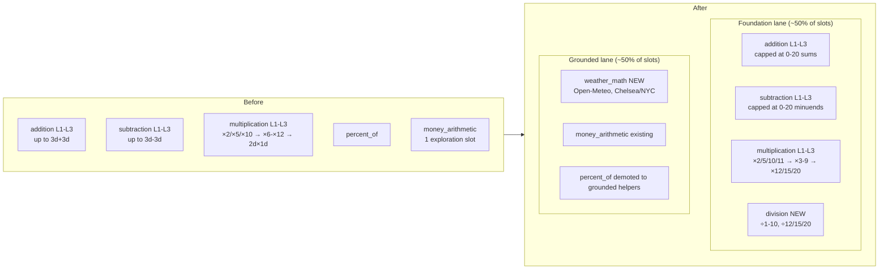
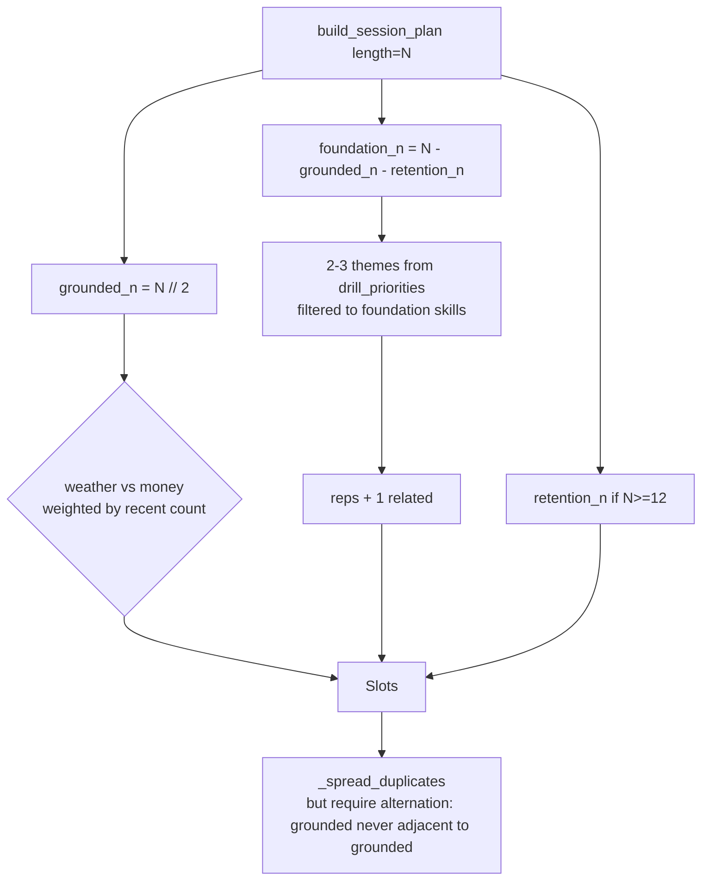

# Curriculum Re-Prioritization

## Context

The scheduler is faithfully indexing on what the data shows (3-digit minus 2-digit with borrow), but that bucket is not a real skill — it is an artifact of how `_gen_subtraction` and the `add:/sub:` fact-keys were built. The user's actual weak primitives are:

- single-digit and small two-digit add/sub in 0–20
- multiplication facts (1–10, plus 12/15/20)
- division as inverse facts on the same set

Separately, half of practice should be grounded (weather + money already, calendar/finances later) so the app is fun enough to use daily and so problems carry the texture of real life. Grounded prompts should still be deterministic — the app feeds *pre-rounded* numbers and expects an exact answer.

Two follow-ons attach to the same change: the per-turn loop needs to be faster, and the user wants this on Android as an APK.

This is a re-prioritization, not a redesign. The diagnosis engine, scheduler shape, fact-key system, attempt log, and review flow all stay. We narrow generator ranges, swap level definitions, add two new skills (`division`, `weather_math`), and replace the single exploration slot with a 50/50 foundation/grounded session quota.

---

## Shape Of The Change





---

## Phase 1 — Foundation Lane (replace the 3d garbage)

### 1.1 Narrow add/sub/mul in `server/generator.py`

`_gen_addition` (server/generator.py:24)
- L1: `a, b = randint(0, 9)` with `a + b <= 20` (kept small so single-digit fluency is the test)
- L2: one operand 1-9, other 10-20; sums always ≤ 30 (e.g., 8 + 14)
- L3: both operands 10-20; sums always ≤ 40 (e.g., 13 + 17)
- Drop the `level == 3 → randint(100, 999)` branch entirely.
- `_addition_with_carry` and `_addition_from_pattern`: same caps; if a 3d pattern is requested the function returns L2-style operands (defensive only — the scheduler will stop generating 3d targets once `_infer_level_from_key` is updated).

`_gen_subtraction` (server/generator.py:96)
- L1: minuend 5-20, subtrahend 0-9
- L2: minuend 11-20, subtrahend 2-12 (forces borrow practice within 0-20)
- L3: minuend 20-30, subtrahend 5-20
- Drop the 3-digit branch.
- `_subtraction_from_hints`: cap r_a at 30, r_b at 20.

`_gen_multiplication` (server/generator.py:156)
- L1: factor in {2, 5, 10, 11} × {1..12}
- L2: both factors in {3, 4, 6, 7, 8, 9} (the canonical bottleneck per docs/skill-progression-research.md)
- L3: one factor in {12, 15, 20}, other in {2..12}
- Drop the `randint(13, 49) × randint(3, 9)` branch.

`_gen_percent_of` (server/generator.py:180)
- Keep but treat as a foundation lane "applied" generator. No structural change.

### 1.2 Add `_gen_division`

New function in `server/generator.py`. Generate a divisor `d` from {1..10, 12, 15, 20} and a quotient `q` from {2..12}, render `d * q ÷ d`. Always integer.

```python
def _gen_division(level, target=None):
    divisors_l1 = [2, 5, 10]
    divisors_l2 = [3, 4, 6, 7, 8, 9]
    divisors_l3 = [11, 12, 15, 20]
    pool = {1: divisors_l1, 2: divisors_l2, 3: divisors_l3}[level]
    if target and target.get("a") is not None and target.get("b") is not None:
        a, b = int(target["a"]), int(target["b"])
    else:
        d = random.choice(pool)
        q = random.randint(2, 12)
        a, b = d * q, d
    return {
        "prompt": f"What is {a} divided by {b}?",
        "expected": float(a / b),
        "parameters": {"a": a, "b": b, "level": level},
    }
```

Register in `GENERATORS` dict.

### 1.3 `skills.yaml` updates

Tighten parameter schemas (cosmetic; the live ranges live in the generator) and add the new skills:

```yaml
- id: addition
  parent: arithmetic
  display_name: Addition (0-20)
  target_latency_ms: 3000          # tightened — single-digit retrieval
  ...
  parameter_schema:
    operand_range: [0, 20]

- id: subtraction
  parent: arithmetic
  display_name: Subtraction (0-30)
  target_latency_ms: 3500
  parameter_schema:
    operand_range: [0, 30]

- id: multiplication
  parent: arithmetic
  display_name: Multiplication facts
  target_latency_ms: 4000

- id: division                     # NEW
  parent: arithmetic
  display_name: Division facts
  target_latency_ms: 4500
  tolerance:
    type: exact
  parameter_schema:
    divisors: [1,2,3,4,5,6,7,8,9,10,12,15,20]
  templates:
    - "What is {a} divided by {b}?"

- id: weather_math                 # NEW (Phase 2)
  parent: grounded
  display_name: Weather math
  target_latency_ms: 9000
  tolerance:
    type: exact                    # numbers are pre-rounded
  parameter_schema:
    operations: [temp_delta, daily_range, f_to_c_approx, wind_delta]
  templates:
    - "Use weather data to answer this question."
```

`server/main.py` already prunes obsolete skills and re-upserts on startup (server/main.py:36-44), so removing/adding skills here is enough.

### 1.4 Diagnosis dispatch for new skills

`server/diagnosis.py:fact_key` (line 12)
- Add a `division` branch that returns `div:{lo}x{hi}` (sorted, since 56/7 and 56/8 are different facts but ÷7 and ÷8 are the families we want to surface).
- Add a `weather_math` branch returning `weather:{operation}` analogous to money.

`fact_display` — add labels: `div:7x8` → "56 ÷ 7 family", `weather:temp_delta` → "Weather: temperature delta".

`factor_family_stats` — extend to also key on `div:` so the profile shows ÷7/÷8 family fluency alongside ×7/×8.

`server/scheduler.py:_skill_from_key` (line 292), `_pick_related` (line 304), `_infer_level_from_key` (line 450) — add cases for `div:` and `weather:`. For `weather:`, level is always 1 (the API gives whole numbers) and there are no related keys.

### 1.5 Strip the obsolete level-3 patterns from related-key generation

`_related_keys` (server/scheduler.py:310) currently generates `add:3d+3d:c` related keys. Cap the generator to 2d patterns. Keep the function as-is otherwise — over time the rolling 300-attempt window will age out 3d entries naturally.

---

## Phase 2 — Grounded Lane (50% quota + weather)

### 2.1 New module `server/weather.py`

Mirror the shape of `server/money.py`. Use Open-Meteo (`https://api.open-meteo.com/v1/forecast`) — no API key, free, rate-limited generously.

Configuration: `data/locations.csv` (one or two rows the user maintains by hand):
```
name,lat,lon
Chelsea NYC,40.7465,-74.0014
NYC,40.7128,-74.0060
```

```python
DEFAULT_LOCATIONS = ROOT / "data" / "locations.csv"
CACHE_PATH = ROOT / "data" / "weather_cache.json"
CACHE_TTL_SECONDS = 6 * 3600

def load_forecast(location: dict) -> dict:
    """Fetch + cache 7-day daily summary for a single location.
    Cached on disk; re-fetched if older than CACHE_TTL_SECONDS."""

def generate_problem(target: dict | None = None) -> dict:
    locations = load_locations()
    location = random.choice(locations)
    forecast = load_forecast(location)
    op = (target or {}).get("operation") or random.choice([
        "temp_delta", "daily_range", "f_to_c_approx", "wind_delta",
    ])
    if op == "temp_delta":
        return _temp_delta(location, forecast)
    ...
```

Generators (numbers are integers from the API or pre-rounded; expected is exact):

| op | example prompt | expected |
|---|---|---|
| `temp_delta` | "Sunday's high in Chelsea is 72. Today's high is 65. How much warmer is Sunday?" | 7 |
| `daily_range` | "Tomorrow in NYC: high 78, low 61. What's the daily range?" | 17 |
| `f_to_c_approx` | "It's 70 in Chelsea. Subtract 30 and halve — what's the rough Celsius?" | 20 (deterministic — we tell them the rule) |
| `wind_delta` | "Tomorrow's wind in Chelsea is 18 mph. Today's is 11 mph. How much stronger?" | 7 |

Key point: the *user* doesn't decide whether to swag — the *prompt* hands them numbers already rounded to whole units. Expected is exact. Tolerance type: `exact`.

Round any decimal returned by Open-Meteo using Python's `round()` before composing the prompt; the rounded value is what goes in `parameters` and what the expected uses.

If the API call fails, fall back to a stub forecast of plausible numbers so the drill still runs offline (similar to `money._fallback_problem`).

### 2.2 Generator wiring

Add to `server/generator.py`:

```python
from server import money, weather
...
def _gen_weather_math(level, target=None):
    problem = weather.generate_problem(target=target)
    problem["parameters"]["level"] = level
    return problem

GENERATORS["weather_math"] = _gen_weather_math
GENERATORS["division"] = _gen_division
```

### 2.3 Scheduler: 50/50 quota in `build_session_plan`

`server/scheduler.py:build_session_plan` (line 91). Replace the current allocation block (`retention_n`, `exploration`, `related_n`, theme reps) with:

```python
GROUNDED_SKILLS = {"money_arithmetic", "weather_math"}
FOUNDATION_SKILLS = {"addition", "subtraction", "multiplication", "division"}

retention_n = 2 if length >= 12 else (1 if length >= 8 else 0)
grounded_n  = length // 2                       # the user's hard requirement
foundation_n = length - grounded_n - retention_n
foundation_n = max(1, foundation_n)              # always at least one foundation theme

# foundation slots: existing theme/related logic, but only over priorities
# whose skill_id is in FOUNDATION_SKILLS
foundation_priorities = [p for p in priorities if p["skill_id"] in FOUNDATION_SKILLS]
themes = _select_diverse_themes(foundation_priorities or priorities, requested_themes)
# allocate foundation_n across themes + 1 related slot if foundation_n >= 5

# grounded slots: split between weather_math and money_arithmetic, weighted
# inversely by recent attempt count so the under-sampled one fills first
grounded_slots = _build_grounded_slots(storage, user_id, grounded_n, skill_targets)
```

Add a helper `_build_grounded_slots`:

```python
def _build_grounded_slots(storage, user_id, n, skill_targets):
    if n <= 0:
        return []
    counts = {sid: storage.skill_attempt_count(user_id, sid)
              for sid in ("weather_math", "money_arithmetic")}
    slots = []
    for i in range(n):
        # alternate, but break ties toward the under-sampled skill
        sid = min(counts, key=lambda s: counts[s])
        op = random.choice(_grounded_ops_for(sid))
        fact_key = f"{sid.split('_')[0]}:{op}"  # weather:temp_delta or money:charge_total
        slots.append(_slot_from_key(
            fact_key, sid, "grounded",
            target_ms=skill_targets.get(sid),
            reason=f"grounded: {sid.replace('_', ' ')}",
        ))
        counts[sid] += 1
    return slots
```

Drop `_exploration_pick` — the grounded quota replaces it. Remove the call site.

`_spread_duplicates` (line 345) is fine but add a soft preference: alternate grounded↔foundation when possible (prevents two weather questions in a row). Cheap implementation: after the existing dedupe pass, swap any adjacent grounded pair with the nearest non-grounded slot.

### 2.4 Plan summary copy

`server/session_analysis.py:plan_summary` (line 17) and `_intent_sentence` — extend so the start screen shows something like:

> Tonight: 6 foundation drills (2× ÷7 family, 2× sub 11-20, 2× ×7) and 6 real-life drills from your weather and spending.

This is one-line UI copy in the plan-summary helpers. No structural change.

---

## Phase 3 — Speed

These are independent of curriculum and can ship in any order. They target the per-turn perceived latency (today: TTS render + user think + STT round-trip + DB write).

### 3.1 Pre-fetch the next question

After `submit_answer` returns, the browser has 1-3 seconds while the user reads the result. Use that to pre-generate and pre-TTS the next question.

- Add `POST /session/peek` in `server/main.py` — same body as `/session/next` but does *not* commit `_active`; returns the same payload and stores the result on `self._sessions[sid]['peek']`.
- Modify `next_question` (server/orchestrator.py:145) to consume `peek` if present, else generate live.
- Modify `web/app.js` to call `/session/peek` immediately after `submit` resolves.

Net effect: the next-question audio starts ~0ms after the user clicks Next, instead of after a full TTS round-trip.

### 3.2 Auto-advance on correct

In `web/app.js`, when `submit` returns `correct: true`, kick off the next question after a 600ms result flash without waiting for a click. User can still abort with End session. (Skim app.js to find the result-render path; this is a 10-line UI change.)

### 3.3 Cheaper STT path

Whisper round-trip is the dominant latency. Two candidates, in order of effort:
- Pass `language="en"` and `temperature=0` to the Whisper request (server/stt.py) — already a small win.
- Switch from `whisper-1` to `gpt-4o-mini-transcribe` if the budget allows; latency is roughly 40% lower at similar accuracy.

### 3.4 Drop `say` on the critical path for portability

macOS `say` only works on Mac. Replace `server/tts.py:synthesize` with a path that uses OpenAI `tts-1` (already paid for) and caches by `prompt_text` SHA. Side benefit: removes one platform dependency before the APK work starts.

---

## Phase 4 — APK

Defer the full Capacitor wrap. The fastest path to "running on my phone" is a Progressive Web App that the user installs from Chrome:

- Add `web/manifest.json` (name, icons 192/512, `display: standalone`, theme color)
- Add a minimal service worker (`web/sw.js`) that caches `/`, `/app.js`, `/styles.css`, `/users.js`, `/debug.js` — read-through for everything else
- Link manifest + register sw from `web/index.html`
- Expose the FastAPI server beyond localhost: bind to `0.0.0.0` and put it behind a Tailscale tailnet or Cloudflare Tunnel (one-time config, not code)
- Once the PWA proves out, wrap with Capacitor for a real APK if the install/share UX still feels weak.

This phase only blocks on Phase 3.4 (browser-only TTS option) since macOS `say` won't work for a phone-served session.

---

## Files Touched

| File | Change |
|---|---|
| `skills.yaml` | tighten ranges, add `division` and `weather_math` |
| `server/generator.py` | rewrite L1-L3 caps for add/sub/mul; add `_gen_division`, `_gen_weather_math`; drop 3d branches |
| `server/weather.py` | NEW: Open-Meteo client + cached forecast + 4 problem generators |
| `server/money.py` | no change |
| `server/diagnosis.py` | add `division` and `weather_math` to `fact_key`, `fact_display`, `factor_family_stats` |
| `server/scheduler.py` | replace allocation block in `build_session_plan` with foundation/grounded/retention quotas; add `_build_grounded_slots`; remove `_exploration_pick`; teach `_skill_from_key` / `_infer_level_from_key` about `div:`/`weather:` |
| `server/session_analysis.py` | extend `_intent_sentence` and role labels with `grounded` |
| `data/locations.csv` | NEW (user-maintained) |
| `web/manifest.json`, `web/sw.js`, `web/index.html` | PWA scaffolding (Phase 4) |
| `web/app.js`, `server/main.py`, `server/orchestrator.py` | prefetch/auto-advance (Phase 3) |
| `docs/todo.md` | update Tier 6 to mark this re-prioritization done; move 3d-2d diagnostic-feature work to "deferred until foundation lane stabilizes" |

---

## Verification

1. **Foundation drills look right.** Run an 8-question drill. Every add/sub/mul prompt should have operands in the new ranges. No 3-digit operands. `attempts` table inspected with `sqlite3 data/feynman.db "SELECT skill_id, prompt_text FROM attempts ORDER BY id DESC LIMIT 8;"` confirms.
2. **50/50 mix.** Start a 12-question drill. The session-plan event in the debug pane shows 6 grounded + 5-6 foundation + (0-1) retention slots. No two grounded in a row.
3. **Weather problems are deterministic.** Watch a few weather drills. Numbers in the prompt are integers; the grader uses `tolerance: exact`; correct answers grade correct.
4. **Diagnosis still works.** After ~30 attempts on the new curriculum, `/profile/{user_id}` returns `next_drills` rooted in `add:1d+1d:c`, `sub:2d-1d:b`, `mul:7x8`, `div:7x8`, `weather:temp_delta` — none of `*:3d*`.
5. **Old data ages out.** Old `add:3d+3d:c` entries continue showing in `slowest_facts` only until they fall outside the 300-attempt rolling window. Confirm by checking `next_drills` weights drop accordingly.
6. **Speed regression.** Time start-of-prompt-audio → Next button click → start-of-next-prompt-audio before and after Phase 3.1. Expect a >500ms drop.
7. **Phone install.** Open the deployed URL in Android Chrome → "Add to Home Screen" → launches as standalone with no URL bar; one full session works end-to-end.

## Out of scope for this plan

- Diagnostic feature tags (`sub.borrow.across_zero`, etc., docs/todo.md Tier 1) — defer until the foundation lane has produced clean data.
- Calendar grounding and finance integrations — same surface as weather; add later, same shape.
- Mid-drill LLM coaching — already disabled and stays that way.
- Full Capacitor APK wrap — only after PWA install proves insufficient.